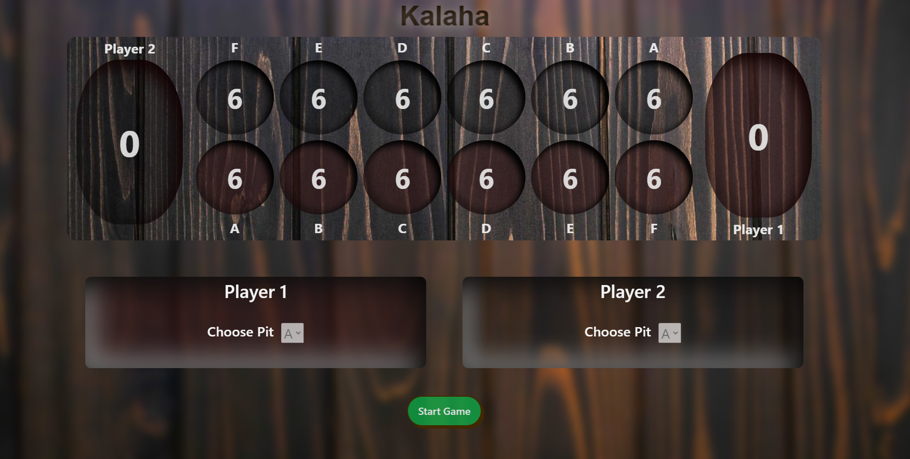
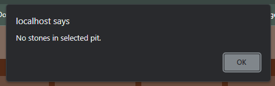
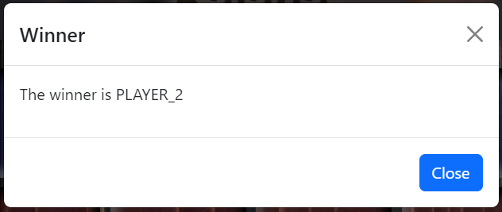
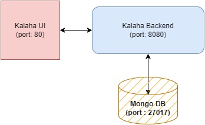
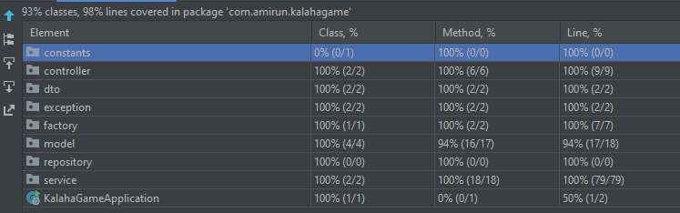
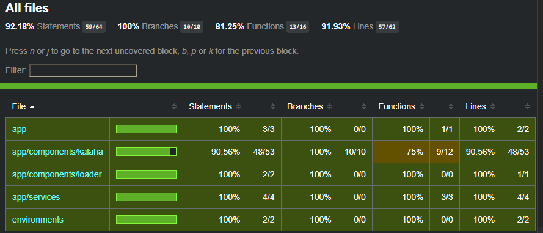

# KALAHA GAME

**This application implements a Kalaha game(UI + Backend).**



## How to Play
1. Each player has part of their board highlighted in different colors.
2. Start playing by clicking on **Start** button.
3. Players can play when its their turn by selecting the pit letter/alphabet (A-F) from the drop-down and click **Play** button.
4. Players are shown error if choosing empty pits.



5. The game stops when a Player wins. A modal pops up informing who is the winner.



6. Click **Close** button to go to home.

**If started with default configuration, these URLs should be accessible.**
### Swagger UI :  http://localhost:8080/swagger-ui/index.html#/
### Game URL :  http://localhost

## Design
This is a simple app with:
1. Spring Boot backend
2. Mongo DB
3. Angular UI



## Project Dependencies
### Backend server
1. Java 17+
2. Maven 3.6.3 or newer
3. Spring Boot 3.1.4
4. Lombok
6. Spring Data Mongo
8. Junit
9. Junit TestContainers

### UI server
1. Angular (v15.2.6)
2. Node.js (v18.18.0)
3. Bootstrap 5

## Getting Started

There are multiple ways to do this.
#### 1. Start application using `docker-compose` from project root. Requires docker.
   ```bash
   docker-compose up -d
   ```
- No manual intervention necessary
- This will spin up a container with the latest mongo image for the application to access the db.
- Build the docker image of the application using the maven and jdk. (Ref: `Dockerfile` in project root)
- Deploy the application to `port 8080` with specified environment variables.

#### 2. Start application manually by running:

   ```bash
   mvn spring-boot:run
   ```
- However, you will need to provide the mongo db connection string via application.properties file by defining properties.
    - `spring.data.mongodb.host=<your db host>`
    - `spring.data.mongodb.port=<your db port>`
    - `spring.data.mongodb.username=<your db username>`
    - `spring.data.mongodb.password=<your db password>`
  
  
- Navigate to `ui` folder, execute:
   ```bash
   npm start
   ```
  You will need to configure the file `ui/src/environments/environment.ts` to point to correct backend url.


## Game flow
1. Game is designed for two players on same system.
2. A new game is created when player starts the game. Game is stored in db.
3. User selects the pit character (A-F) based on their turn. Choose characters instead of numbers for pits to make the UI less cluttered with just numbers.
4. Every move makes changes to the game board, persists the change and responds with the updated board status.
5. Captures are added to big pit of the player.
6. Player repeats if their move finishes on their own big pit.
7. Application decides winner when all pits of any one player are empty. 

## Features
1. Multiple games can be played simultaneously.
2. Offline 2 players: both players playing on same system.


## Testing
Test coverage(UT and IT):

**Backend:**

 

**UI:**

 
Most UI test cases were auto-generated using AI tools, and UI designing was done using various online tools.

## Possible Enhancements/Upgrades
1. **Variations**: Game can be easily modified to support different initial pit size and who goes first. `GameFactory` can create games with different initial pit size(s) and player turns.
2. **Pause/Resume feature**: Using the getGame(`/{gameId}` endpoint) api, we can easily enhance game to enable continuing an existing game.
3. **Two players online**: both players can join from separate clients. This feature can be implemented using the existing APIs and enhancing the UI.
4. **User profile**: Enhance with `Spring Boot Security`. We can persist users for enabling features like user profile, game history.
5. **Replay game**: game replay feature by using caching mechanisms(with redis db).
6. **Discovery + Load balancing + Monitoring**: Using full spring cloud features, we can enhance the application to support service discovery(Consul), load-balancing(using Ribbon), distributed tracing(Spring Sleuth + Zipkins), Redis db(caching),
7. **Logging**: ELK stack for log analysis.
8. **Clean up**: Batch jobs to clean old games.
